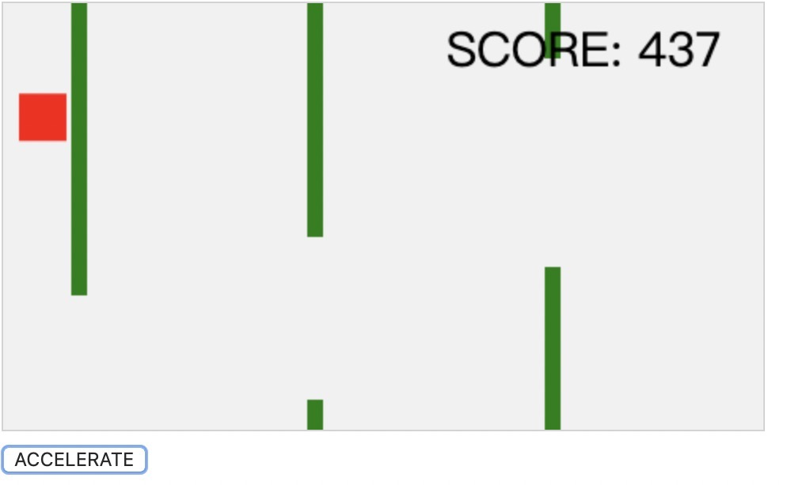

* * *

创建收集这些javascript 文件作为实验学习，
同时也为自己解决工作上的一些问题。我也希望给那些需要使用这个脚本或节省时间搜索互联网和刚开始学习的人一些帮助，欢迎大家指出问题一起加入分享，简化或提高代码的效率
* * *
**这些脚本允许您快速解决问题并节省您所浪费的时间**
###  
  * [create-dir-if-not-there.js](./create-dir-if-not-there.js) -检查用户主目录中是否存在目录，如果不存在，则创建它。
  
  * [use-recursive-traverse-folder.js](./use-recursive-traverse-folder.js) -通过递归遍历文件夹文件
  
  * [use-glob-traverse-folder.js](./use-glob-traverse-folder.js) -通过使用glob模块遍历文件夹文件
  
  * [build-compress-files.js](./build-compress-files.js) -压缩文件生成压缩包如.zip格式文件
  
  * [logger.js](./logger.js) -在node cli情况下的日志输出格式
  
  * [unwxapkg](./unwxapkg) -解压.wxapkg格式文件包(引用地址:https://github.com/thedreamwork/unwxapkg)

  * [crawl-iQIYI-movie-resources.js](./crawl-iQIYI-movie-resources.js) -在node环境下爬取爱奇艺电影资源
***
###  正则表达式处理相关
* [regular](./regular/README_zh.md) - 工作中经常使用和学习的正则处理
  * [密码强度](./regular/README_zh.md) 
  * [帐号是否合法](./regular/README_zh.md) 
  * [Email邮箱地址](./regular/README_zh.md) 
  * [域名验证](./regular/README_zh.md) 
  * [手机号码验证]() 
  * [QQ验证](./regular/README_zh.md) 
  * [中国邮政编码验证](./regular/README_zh.md) 
  * [日期格式验证](./regular/README_zh.md) 
  * [身份证号码验证](./regular/README_zh.md) 
  * [IP地址验证](./regular/README_zh.md) 
  * [首尾空白字符验证](./regular/README_zh.md) 
***
###  js游戏、工具、好玩有意思相关项目学习
 #### 游戏案例
 * [game1]()- 使用加速按钮保持在空中 看你可以保持多久

 

  * [game2]()- 在不同的障碍物上奔跑，跳跃或冲刺

   

 #### 工具案例

